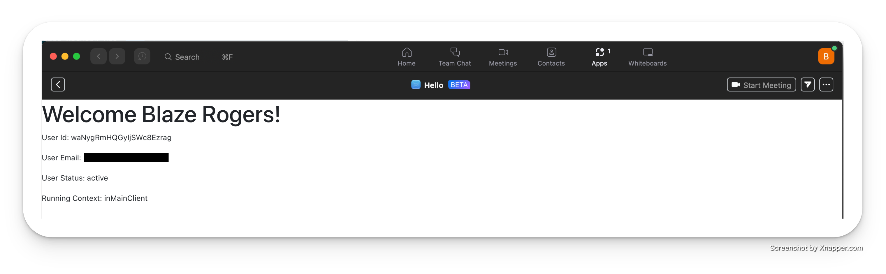

Running the application:
- Go to: https://46e3-181-224-243-194.sa.ngrok.io/api/zoomapp/install
- After installing the app insure that you're logged in to your zoom account as guest mode is not enabled.
- Go to your apps and click on 'Hello'
- You should see a welcome message with a few data points. 

Tech stack: react js, node.js, express, running on ngrok, docker

Below is an example of the home page of the app:

#### Endpoints

- API endpoints and events being used:
  - `config` used for authorization of logged in user
  - `getMeetingContext`
  - `getMeetingUUID`
  - `onMeeting`

